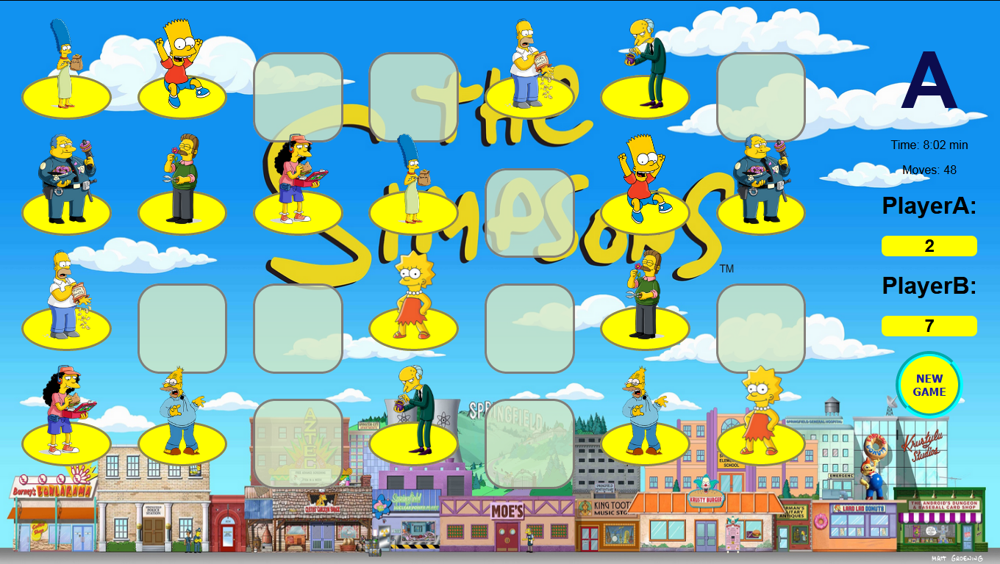

# Match-Pairs-Memory-Game
Classical memory game written in HTML, JS, CSS

 

## Features
* 28 field two player memory game
* Timer
* Moves counter

* Random game solver function: 
'function gameSolver()'

# Good luck !

